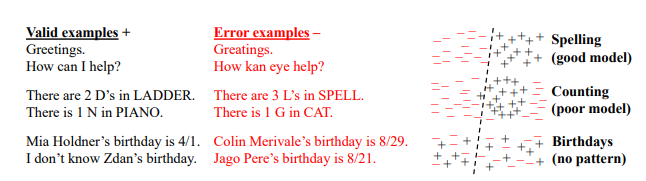
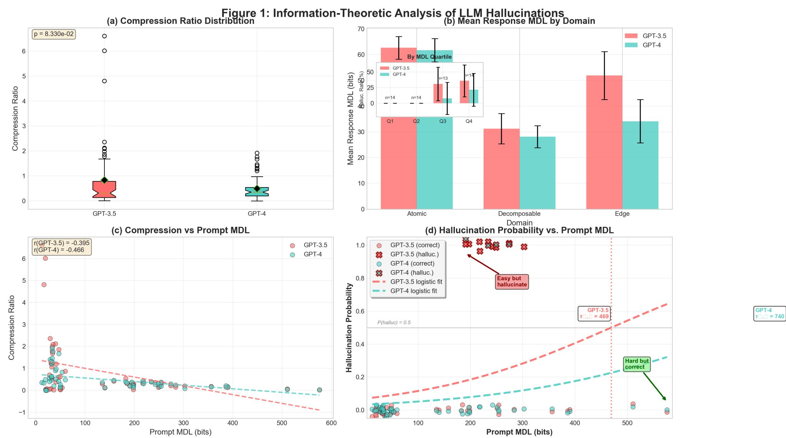
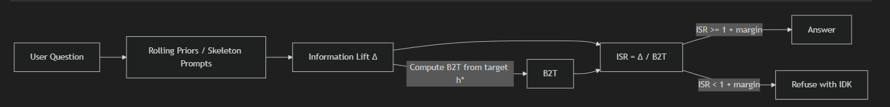

Here’s a clean, ready-to-paste Markdown post you can drop into your GitHub blog.

---

# From Guessing to Guarantees: Two Fresh Paths to Reducing LLM Hallucinations

**TL;DR**
Two recent works attack hallucinations from different angles. **OpenAI** explains *why* overconfident errors persist—our training **and** evaluation norms reward guessing over “I don’t know”—and argues for abstention-aware benchmarks. **Hassana Labs** turns hallucination risk into a *measurable quantity* using an information-theoretic planner (EDFL/B2T/ISR) that gates answers when there isn’t enough evidence. Together, they point to a pragmatic future: **fewer wrong answers, more calibrated refusals, and deployable controls**. ([OpenAI][1])

---

## Why LLMs Still “Bluff”

OpenAI’s analysis links hallucinations to incentives across **pre-training** and **post-training**:

* **Pre-training:** Next-token prediction (cross-entropy) implies an inherent binary decision—*is this candidate output valid?*—which yields unavoidable error bounds even for strong models. ([OpenAI CDN][2])
* **Post-training & eval:** Today’s evals rarely allow *abstain/IDK* and often *reward confident guessing*, teaching models to answer when uncertain. OpenAI argues benchmarks should **permit IDK** and **penalize wrong answers more than refusals**, realigning incentives toward honesty. ([OpenAI][1])

**Practical takeaway:** If your metric punishes “I don’t know,” you’re training your system to bluff.


<figcaption align="center"><b>Figure:</b> OpenAI’s analysis reveals how training and evaluation incentives drive models to guess rather than abstain, contributing to persistent hallucinations.</figcaption>

---

## Predicting (and Preventing) Hallucinations with Information Budgets

Hassana Labs frames hallucinations as **predictable compression failures**: models compress the world; rare facts and thin evidence make reliable recovery impossible. They propose **EDFL** (Expectation-level Decompression Law) and a deployable planner:

* **B2T (Bits-to-Trust):** How many bits of information are required to meet your target reliability (e.g., ≤5% hallucination rate).
* **ISR (Information Sufficiency Ratio):** Observed information lift divided by B2T.
* **Decision rule:** **Answer iff** `ISR ≥ 1` (plus margin); otherwise **refuse**.
* **RoH (Risk of Hallucination):** A bound on error given the measured info budget and priors.

In evaluations, a pre-specified ISR=1.0 policy achieved **near-0% hallucinations** with **~24% abstentions**—trading coverage for reliability in a controlled, auditable way. ([arXiv][3])

**Why this matters:** You get **knobs you can turn**—target error rates, margins, priors—*without changing the base model*. ([GitHub][4])

<figcaption align="center"><b>Figure:</b> Hassana Labs illustrates that LLMs behave as Bayesian estimators on average, but individual outputs may deviate—highlighting the gap between theoretical reliability and realized answers.</figcaption>

---

## How the Two Fit Together

* **OpenAI:** Fix incentives upstream—train and **evaluate** so models aren’t pushed to guess.
* **Hassana Labs:** Add **deployment-time safety rails** that measure info sufficiency per query and gate answers.

Do both, and you shift from *“hope it’s right”* to **“make it right or politely decline.”** ([OpenAI][1])

---

## A Mental Model


<figcaption align="center"><b>Figure:</b> Mental Model on how both systems can be integrated to reduce hallucinations.</figcaption>
---

## Try It: HallBayes in 5 Minutes

The Hassana Labs repo includes a CLI and Python planner for OpenAI-compatible backends.

```bash
# 1) Clone
git clone https://github.com/leochlon/hallbayes
cd hallbayes

# 2) Set your OpenAI key
export OPENAI_API_KEY=sk-...

# 3) Quick single-prompt check (closed-book)
python scripts/quick_eval.py "Who won the 2019 Nobel Prize in Physics?"

# 4) Interactive mode
python scripts/quick_eval.py --interactive

# 5) Batch from file
python scripts/quick_eval.py --file prompts.txt --output results.json
```

Minimal Python example (closed-book policy, target ≤5% hallucination rate):

```python
from scripts.hallucination_toolkit import OpenAIBackend, OpenAIItem, OpenAIPlanner

backend = OpenAIBackend(model="gpt-4o-mini")
item = OpenAIItem(
    prompt="Who won the 2019 Nobel Prize in Physics?",
    n_samples=7,      # stability
    m=6,              # number of skeletons
    skeleton_policy="closed_book"
)

planner = OpenAIPlanner(backend, temperature=0.3)
metrics = planner.run([item], h_star=0.05, isr_threshold=1.0, margin_extra_bits=0.2)

m = metrics[0]
print("Decision:", "ANSWER" if m.decision_answer else "REFUSE")
print("Risk bound (RoH):", m.roh_bound)
if m.decision_answer:
    from scripts.hallucination_toolkit import generate_answer_if_allowed
    print("Answer:", generate_answer_if_allowed(backend, item, m))
```

The repo’s README also covers an evidence-based mode (for RAG) where you **mask the evidence** in skeletons, then require sufficient Δ to answer. ([GitHub][4])

---

## Where This Leaves Practitioners

**1) Change how you *score* models.**
Adopt abstention-aware metrics: report **Coverage** (answers / total), **Accuracy-when-Answering**, and **Hallucination Rate** (or risk bound) under a chosen **h***. This avoids rewarding blind guesses. ([OpenAI][1])

**2) Gate answers by information sufficiency.**
Pick h* (e.g., 5–10%), tune margins, and set skeleton policies. Start permissive in low-risk UX; tighten for regulated flows. ([arXiv][5])

**3) Make RAG pull its weight.**
Hallucinations drop as Δ grows—*bring evidence*. Use short, high-signal context; avoid noisy dumps. Evidence that increases Δ helps the gate clear B2T. ([GitHub][4])

**4) Calibrate the refusal experience.**
Return helpful IDK fallbacks: *“I’m not confident. Here’s what I’d need to answer, or would you like me to search?”* This preserves trust while guiding users.

---

## Limitations & Open Questions

* **Abstention cost:** Reliability improves as coverage falls—tune per use case. ([arXiv][3])
* **Overhead:** Skeleton generation and multiple samples add latency/compute.
* **Theory is new:** Hassana’s theory is fresh (preprints); community replication and benchmarks will harden it. ([arXiv][5])
* **No silver bullet:** Some hallucinations are theoretically unavoidable in general-purpose models—mitigation, not elimination, is the goal. ([arXiv][6])

---

## The Big Picture

We’re not stuck with “hallucinations just happen.” If we **stop rewarding guesses** and **measure information**, we can ship systems that say *“I don’t know”* when they should—and are **reliably right** when they answer. Problems once seen as inherent feel a lot closer to solved—**not by magic model upgrades, but by better incentives and deployable gates**. ([OpenAI][1])

---

## References 

* OpenAI — *Why Language Models Hallucinate* (analysis + evaluation guidance). ([OpenAI][1])
* Hassana Labs — *Predictable Compression Failures* (EDFL/B2T/ISR theory + planner) and **HallBayes** implementation. ([arXiv][5])
* Background — *Hallucination is Inevitable* (limits context). ([arXiv][6])

---


```text
OpenAI blog: https://openai.com/index/why-language-models-hallucinate/
OpenAI paper (PDF): https://cdn.openai.com/pdf/d04913be-3f6f-4d2b-b283-ff432ef4aaa5/why-language-models-hallucinate.pdf
Hassana Labs arXiv: https://arxiv.org/abs/2509.11208
HallBayes repo: https://github.com/leochlon/hallbayes
```

---

[1]: https://openai.com/index/why-language-models-hallucinate/?utm_source=chatgpt.com "Why language models hallucinate"
[2]: https://cdn.openai.com/pdf/d04913be-3f6f-4d2b-b283-ff432ef4aaa5/why-language-models-hallucinate.pdf?utm_source=chatgpt.com "Why Language Models Hallucinate"
[3]: https://arxiv.org/abs/2509.11208?utm_source=chatgpt.com "Predictable Compression Failures: Why Language Models Actually Hallucinate"
[4]: https://github.com/leochlon/hallbayes "GitHub - leochlon/hallbayes"
[5]: https://www.arxiv.org/pdf/2509.11208?utm_source=chatgpt.com "Predictable Compression Failures: Why Language Models ..."
[6]: https://arxiv.org/abs/2401.11817?utm_source=chatgpt.com "Hallucination is Inevitable: An Innate Limitation of Large Language Models"
