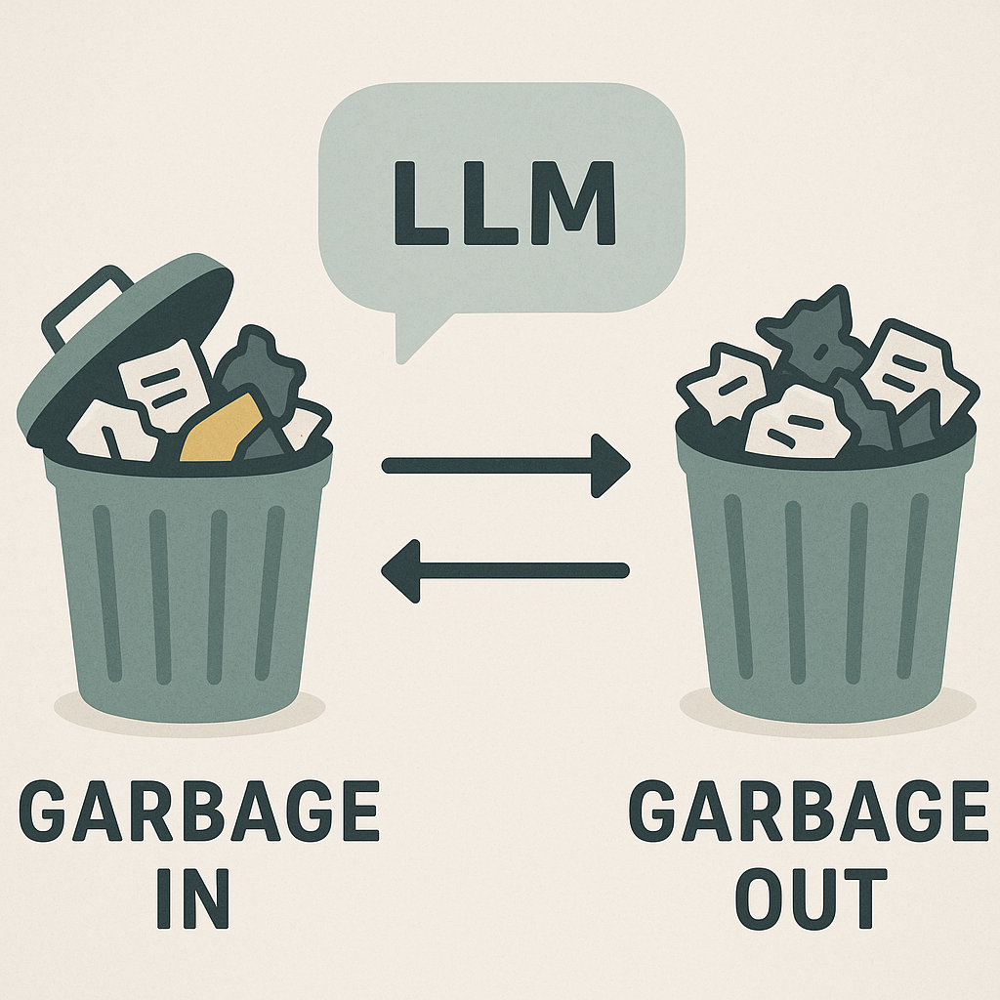

# Are LLMs/ChatGPT/etc. Really Deterministic?

If you’ve worked with large language models (LLMs), you’ve probably noticed something odd: sometimes you give the *exact same* prompt, with the *exact same* parameters, and still get slightly different outputs.  

Isn’t that strange? Shouldn’t the model be deterministic?  
The short answer: **mathematically, yes. In practice, not always.**

This post unpacks the sources of variation, the role of parameters like temperature and top-p, and why even “deterministic” settings can produce surprising results.

---
## Lets Start with ChatGPT

Feeding the same input gives different outputs. But if you give a computer system the same input why would it give different outputs?

  
*Example 1*

  
*Example 2*

  
*Example 3*

## What Others Are Saying (and Why It’s Incomplete)

If you search “why are LLMs not deterministic,” you’ll find lots of confident but incomplete explanations:

- [Sitation blog: *Non-Determinism in AI LLM Output*](https://www.sitation.com/blog/non-determinism-in-ai-llm-output)  
- [Substack post: *Why are LLMs not deterministic?*](https://axldpi.substack.com/p/why-are-llms-not-deterministic)  
- [Reddit discussion thread: Non deterministic behaviour in LLMs when temperature set to 0](https://www.reddit.com/r/MachineLearning/comments/16hmwcc/discussion_non_deterministic_behaviour_in_llms/)

These sources mostly attribute non-determinism to:

- the complexity of neural networks,  
- the idea that setting temperature or sampling strategy is all that matters, or  
- vaguely invoking “randomness in AI” without detailing where it comes from.

What they often miss is the distinction between:

1. **Designed randomness** (sampling, temperature, top-p, top-k) vs  
2. **Implementation or system nondeterminism** (floating-point arithmetic, kernel implementations, batch effects, hardware, etc.)

Let’s dig into both.

---

## The Determinism of LLMs (in Theory)

At their core, LLMs are deterministic mathematical functions. Give it the same garbage, it will give you garbage out, right ? 
  
*Garbage In Garbage Out*

But seriously, if you fix:

- the model’s weights (no changes),  
- the exact input token sequence,  
- and all hyperparameters of inference (sampling strategy, decoding method, etc.),

then the internal operations (attention, matrix multiplication, softmax, etc.) always produce the same outputs.

So any variation in output must come from:

- **explicit randomness**, or  
- **subtle differences in how operations are carried out** under different hardware, software, or execution contexts.

---

## Common Misconceptions

| Myth                                                        | Reality                                                                                                  |
| ----------------------------------------------------------- | -------------------------------------------------------------------------------------------------------- |
| “LLMs are non-deterministic because they’re too complex”    | Complexity isn’t randomness. The math is deterministic; randomness comes from sampling & implementation. |
| “Set temperature = 0 and you’ll always get the same result” | Not necessarily — kernels, batching, and hardware can still cause drift.                                 |
| “Non-determinism is unavoidable”                            | It can be reduced (batch-invariant kernels, deterministic algorithms), but may trade off performance.    |

---

## How Temperature, Top-p, and Top-k Add Controlled Variation

These parameters are where users and systems introduce randomness, by design. Here’s how:

- **Temperature** scales the model’s output distribution. High temperature → a flatter distribution → more chance of picking less likely tokens.  
- **Top-k sampling** limits choices at each token to the *k* most probable options, then picks randomly among them.  
- **Top-p (nucleus) sampling** takes the smallest set of tokens whose total probability reaches *p*, and samples from that truncated distribution.

If you choose greedy decoding (always pick the highest probability token, no sampling) and set temperature so that sampling is disabled, then *in theory* there is no randomness from those components.

---

## “Defeating Nondeterminism in LLM Inference” — Thinking Machines

Thinking Machines published a blog post titled **[Defeating Nondeterminism in LLM Inference](https://thinkingmachines.ai/blog/defeating-nondeterminism-in-llm-inference/)** 

Some of their key points:

- Even when temperature = 0 (greedy decoding, which should in theory remove sampling-based randomness), LLMs are often non-deterministic in practice.
- A common hypothesis is that *floating-point non-associativity* + *concurrent execution* (threads finishing in different orders) causes variation. Thinking Machines call this the “concurrency + floating point” hypothesis.  
- But they argue that this hypothesis does *not* fully explain the observed nondeterminism. For example, many kernels used in LLM inference are deterministic, and forward passes can produce bit-identical results under many conditions.   
- Their conclusion: the biggest cause of nondeterminism for inference endpoints is varying **batch sizes**, driven by varying server load. As load varies, batch size of requests changes, which can cause different execution paths / kernel invocations that are *not batch-invariant*, resulting in different numeric results. 
- They introduce the notion of **batch-invariant kernels**, i.e. kernel implementations that produce bit-identical results regardless of how requests are batched. They present work to replace or adapt key operations (like reductions) so that they behave the same whether batch size or other context changes. 
---

## Why Outputs Still Differ Even When You Think Everything Is Fixed

Combining the theory above with empirical observations, here are the places where variation creeps in even when you believe you’ve eliminated randomness:

- Floating-point rounding / non-associative summations, especially in reductions or aggregations.  
- Kernel implementations: some operations behave differently depending on batch dimension, tile size, or whether threads are used in a certain way.  
- Batch size effects: different batch sizes may trigger different kernels or different internal parallelization strategies.  
- Hardware / inference engine: GPU vs CPU vs specialized accelerators, different vendors or driver versions, different backend libraries.  

---

## Why It Matters

- **Reproducibility in research**: you may think you have fixed seed + greedy decoding, but results may still drift across runs, machines, or when scaling.  
- **Consistency in production**: for logging, auditing, compliance, and user expectations, consistency of outputs can matter (especially in applications like code generation, legal, etc.).  
- **Debugging / testing**: flaky behavior undermines trust. If a model sometimes produces different output under supposedly identical settings, diagnosing bugs or biases becomes harder.  

---

## Closing Thoughts

- LLMs *are* deterministic in their mathematical design.  
- Randomness is introduced by choice (temperature, sampling) *and* by implementation / execution context.  
- The Thinking Machines work shows that to get *practical determinism*, you need to ensure **batch-invariance**, use deterministic kernels, and control for variable system load.  

So next time your model gives a different answer with “temperature = 0,” don’t just blame sampling — check how inference is batched, what backend kernels are used, and whether your system’s load is changing behind the scenes.  

Consistency is not just about settings; it’s about the whole stack.

---

